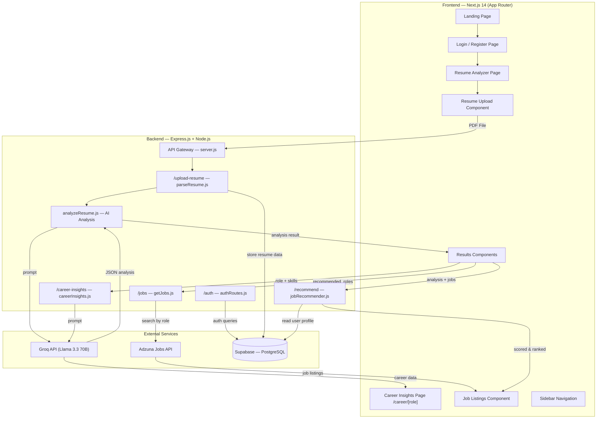
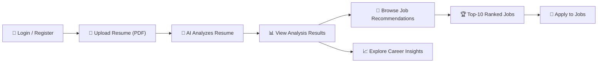
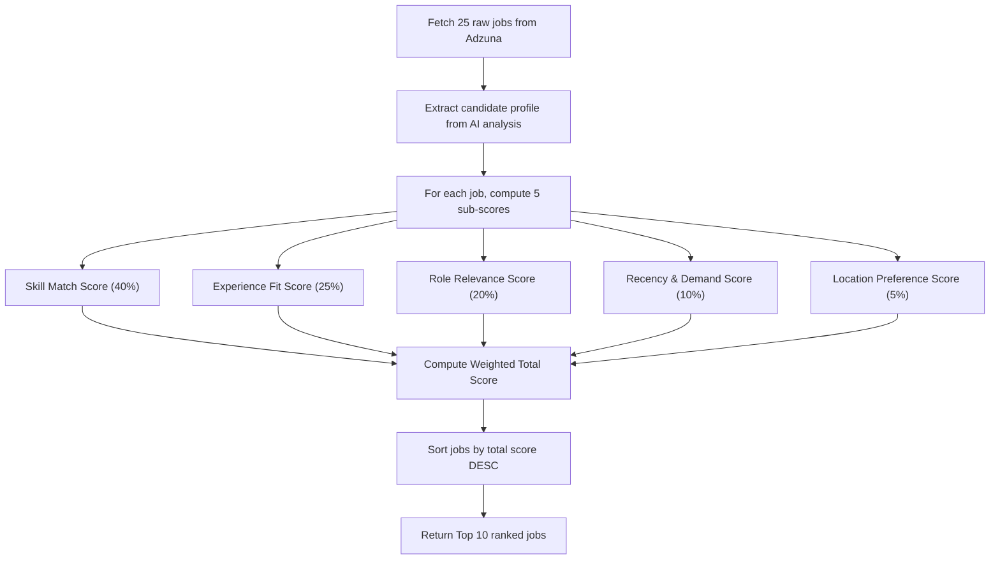
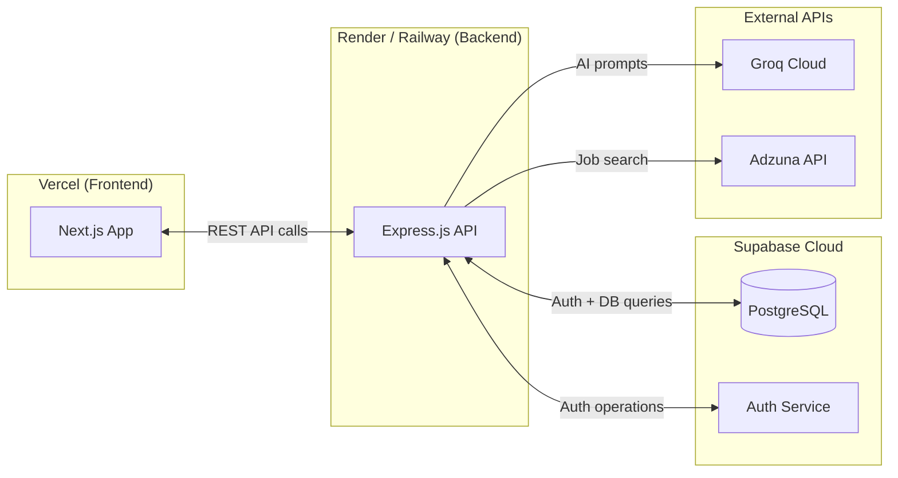

# HireAssist — Complete Project Documentation

> **AI-Powered Resume Analyzer & Career Assistant**
> An intelligent web platform that analyzes resumes using AI, recommends jobs, provides career insights, and ranks job opportunities based on candidate-fit probability.

---

## 1. System Architecture



### Architecture Summary

| Layer | Technology | Purpose |
|-------|-----------|---------|
| **Frontend** | Next.js 14 (React, TypeScript) | UI, routing, client-side state |
| **Backend** | Express.js (Node.js) | REST API, business logic, AI orchestration |
| **AI Engine** | Groq Cloud — Llama 3.3 70B | Resume analysis, career insights generation |
| **Jobs API** | Adzuna API | Real-time job listing aggregation |
| **Database** | Supabase (PostgreSQL) | User auth, profiles, resume history, analytics |
| **Auth** | Supabase Auth | Email/password & OAuth login |

---

## 2. User Workflow



### Step-by-Step Flow

| Step | Action | System Behavior |
|------|--------|-----------------|
| 1 | User opens HireAssist | Landing page with features overview |
| 2 | User logs in or registers | Supabase Auth handles session; JWT issued |
| 3 | User uploads PDF resume | File sent to `/upload-resume` via multipart form |
| 4 | Backend parses PDF | `pdf-parse` extracts raw text from the PDF |
| 5 | AI analyzes resume text | Groq Llama 3.3 extracts skills, experience, gaps, roles |
| 6 | Results displayed | Frontend shows skills, frameworks, languages, gaps, roles |
| 7 | Jobs fetched from Adzuna | Up to 5 roles queried, 5 results each → 25 raw jobs |
| 8 | **Job Ranking Algorithm runs** | **Weighted scoring ranks jobs → Top 10 shown in order** |
| 9 | Career insights generated | Groq generates salary data, interview questions, top companies |
| 10 | User browses & applies | Redirect links to original job postings |

---

## 3. List of Modules

### 3.1 Frontend Modules

| Module | File | Description |
|--------|------|-------------|
| **Landing Page** | [app/page.tsx](file:///c:/Users/navva/OneDrive/Desktop/git-slove/hireAssist/frontend/src/app/page.tsx) | Hero section, features overview, how-it-works, CTA |
| **Login Page** | `app/login/page.tsx` | Email/password login, OAuth buttons, registration form |
| **Resume Analyzer** | `app/analyzer/page.tsx` | Upload zone, loading states, results dashboard |
| **Career Insights** | `app/career/[role]/page.tsx` | Dynamic page per role — salary, interviews, companies |
| **Resume Upload** | `components/upload/ResumeUpload.tsx` | Drag-and-drop PDF upload with validation |
| **Results Panel** | `components/results/Results.tsx` | Skills display, gap analysis, role recommendations |
| **Job Listings** | `components/job-card/JobListings.tsx` | Ranked job cards with company, salary, apply links |
| **Sidebar** | `components/sidebar/Sidebar.tsx` | Navigation and quick filters |
| **Auth Context** | `contexts/AuthContext.tsx` | Supabase session provider, protected route wrapper |
| **Type Definitions** | [app/types.ts](file:///c:/Users/navva/OneDrive/Desktop/git-slove/hireAssist/frontend/src/app/types.ts) | TypeScript interfaces for all data models |

### 3.2 Backend Modules

| Module | File | Description |
|--------|------|-------------|
| **API Server** | [server.js](file:///c:/Users/navva/OneDrive/Desktop/git-slove/hireAssist/backend/server.js) | Express app, CORS, JSON parsing, route mounting |
| **Resume Parser** | [routes/parseResume.js](file:///c:/Users/navva/OneDrive/Desktop/git-slove/hireAssist/backend/routes/parseResume.js) | PDF upload (multer), text extraction (pdf-parse), triggers AI |
| **Resume Analyzer** | [routes/analyzeResume.js](file:///c:/Users/navva/OneDrive/Desktop/git-slove/hireAssist/backend/routes/analyzeResume.js) | Groq API call — extracts skills, experience, gaps, roles |
| **Job Fetcher** | [routes/getJobs.js](file:///c:/Users/navva/OneDrive/Desktop/git-slove/hireAssist/backend/routes/getJobs.js) | Adzuna API integration — fetches jobs by role + location |
| **Career Insights** | [routes/careerInsights.js](file:///c:/Users/navva/OneDrive/Desktop/git-slove/hireAssist/backend/routes/careerInsights.js) | Groq API call — salary estimates, interview Qs, companies |
| **Auth Routes** | `routes/authRoutes.js` | Login, register, logout, session refresh via Supabase Auth |
| **Job Recommender** | `routes/jobRecommender.js` | **Weighted scoring algorithm — ranks & returns Top 10 jobs** |
| **DB Client** | `config/supabase.js` | Supabase client initialization (service role key) |

### 3.3 Database Tables (Supabase)

| Table | Purpose |
|-------|---------|
| `users` | User profiles (managed by Supabase Auth) |
| `resumes` | Stored resume text, analysis JSON, timestamps |
| `job_searches` | Cached job search results per user |
| `user_preferences` | Preferred locations, salary range, role interests |

---

## 4. Proposed Algorithm — Top-10 Job Recommendation

### 4.1 Algorithm: Weighted Multi-Factor Scoring (WMFS)

The system uses a **Weighted Multi-Factor Scoring** algorithm to rank all fetched jobs and select the top 10 that the candidate has the highest probability of getting accepted into.



### 4.2 Scoring Factors

| Factor | Weight | How It's Computed |
|--------|--------|-------------------|
| **Skill Match** | 40% | Jaccard similarity between candidate's `technical_skills + frameworks + languages` and keywords extracted from job description using TF-IDF tokenization |
| **Experience Fit** | 25% | Gaussian penalty function: `exp(−(candidate_years − required_years)² / 2σ²)` where σ = 2. Perfect fit = 1.0, large mismatch → 0 |
| **Role Relevance** | 20% | Cosine similarity between the AI's `recommended_roles` and the job title, using word embeddings (Llama 3.3 embedding or simple TF-IDF vectors) |
| **Recency & Demand** | 10% | Exponential decay based on job posting age + demand multiplier from Adzuna's count of similar roles |
| **Location Preference** | 5% | Binary match (1.0 if job location matches user preference, 0.5 otherwise) |

### 4.3 Algorithm Pseudocode

```
function rankJobs(candidateProfile, jobs):
    scores = []

    for each job in jobs:
        // 1. Skill Match (Jaccard Similarity)
        candidateSkills = union(profile.technical_skills, profile.frameworks, profile.languages)
        jobKeywords    = extractKeywords(job.description)  // TF-IDF tokenizer
        skillScore     = |candidateSkills ∩ jobKeywords| / |candidateSkills ∪ jobKeywords|

        // 2. Experience Fit (Gaussian)
        requiredYears  = parseExperienceFromDescription(job.description)
        candidateYears = parseFloat(profile.experience_years)
        expScore       = exp(-(candidateYears - requiredYears)² / 8)

        // 3. Role Relevance (Cosine Similarity)
        roleScore      = cosineSimilarity(
                            tfidfVector(profile.recommended_roles),
                            tfidfVector(job.title)
                         )

        // 4. Recency & Demand
        daysSincePosted = (now - job.posted_date).days
        recencyScore    = exp(-daysSincePosted / 30)  // 30-day half-life

        // 5. Location Preference
        locationScore   = (job.location matches userPref) ? 1.0 : 0.5

        // Weighted Total
        totalScore = (0.40 * skillScore)
                   + (0.25 * expScore)
                   + (0.20 * roleScore)
                   + (0.10 * recencyScore)
                   + (0.05 * locationScore)

        scores.push({ job, totalScore })

    // Sort descending and return top 10
    scores.sort(by: totalScore DESC)
    return scores.slice(0, 10)
```

### 4.4 Why This Algorithm?

| Consideration | Reasoning |
|---------------|-----------|
| **Skill Match as heaviest factor** | Employers filter candidates primarily on skills; highest correlation with acceptance |
| **Gaussian for experience** | Tolerates ±2 year variance gracefully; doesn't harshly penalize close matches |
| **Cosine similarity for roles** | Captures semantic closeness (e.g., "Frontend Developer" ↔ "React Engineer") |
| **Recency decay** | Newer postings are more likely to still be accepting applications |
| **Location is lightweight** | Remote work is common; location is a soft preference, not a dealbreaker |

---

## 5. Expected Results Per Module

### 5.1 Login & Authentication Module

| Metric | Expected Result |
|--------|----------------|
| Registration | User creates account with email/password or Google OAuth |
| Session management | JWT-based sessions via Supabase; auto-refresh tokens |
| Protected routes | Unauthenticated users redirected to login from `/analyzer` and `/career/*` |
| Data persistence | Resume analyses tied to user ID; accessible across sessions |

### 5.2 Resume Analysis Module

| Metric | Expected Result |
|--------|----------------|
| Parse accuracy | Successfully extracts text from 95%+ of standard PDF resumes |
| AI extraction | Returns structured JSON with skills, frameworks, languages, experience, roles, gaps |
| Response time | ~3–5 seconds per analysis (Groq API latency) |
| Error handling | Graceful fallback with toast notifications on parse or API failures |

**Sample Output:**
```json
{
  "technical_skills": ["React", "Node.js", "PostgreSQL", "Docker"],
  "soft_skills": ["Team Leadership", "Communication"],
  "languages": ["JavaScript", "TypeScript", "Python"],
  "frameworks": ["Next.js", "Express.js", "TailwindCSS"],
  "experience_years": "3",
  "recommended_roles": ["Full Stack Developer", "Frontend Engineer", "React Developer"],
  "missing_skills": ["AWS", "CI/CD", "GraphQL", "Kubernetes"]
}
```

### 5.3 Job Recommendation Module (Top-10 Algorithm)

| Metric | Expected Result |
|--------|----------------|
| Input | 25 raw jobs from Adzuna (5 roles × 5 jobs each) + candidate profile |
| Output | Top 10 jobs ranked by acceptance probability (score 0.0–1.0) |
| Ranking accuracy | Top-3 jobs should have skill-match ≥ 60% with candidate profile |
| Diversity | Top 10 should span at least 2–3 different role categories |
| Display | Ranked cards showing position (#1–#10), match %, title, company, salary |

**Sample Ranked Output:**

| Rank | Job Title | Company | Match Score | Key Match Reason |
|------|-----------|---------|-------------|-----------------|
| #1 | Senior React Developer | Infosys | 0.92 | 5/6 skills match, 3yr experience fit |
| #2 | Full Stack Engineer | TCS | 0.87 | 4/6 skills, role relevance high |
| #3 | Frontend Developer | Wipro | 0.81 | React + TypeScript match |
| ... | ... | ... | ... | ... |
| #10 | Node.js Developer | Zoho | 0.54 | Backend skills partial match |

### 5.4 Career Insights Module

| Metric | Expected Result |
|--------|----------------|
| Salary estimates | INR salary ranges for entry / mid / senior levels + candidate-specific estimate |
| Interview questions | 6 technical + 4 behavioral questions with answer hints |
| Top companies | 5 companies in India actively hiring for the role |
| Role description | 2–3 sentence overview of the job role |
| Personalization | Salary estimate tailored to candidate's specific experience and skills |

### 5.5 Database Module (Supabase)

| Metric | Expected Result |
|--------|----------------|
| Auth latency | < 500ms for login/register operations |
| Resume storage | Full analysis JSON stored per user; queryable history |
| Data retention | Users can view past analyses from their dashboard |
| Security | Row-Level Security (RLS) policies ensure users access only their own data |

---

## 6. Technology Stack Summary

| Category | Technology | Version / Details |
|----------|-----------|-------------------|
| Frontend Framework | Next.js | 14+ (App Router) |
| UI Language | TypeScript + React | Component-based architecture |
| Styling | TailwindCSS | Custom design system with brand tokens |
| Backend Runtime | Node.js + Express.js | REST API |
| AI Model | Groq — Llama 3.3 70B | Resume analysis + career insights |
| Jobs API | Adzuna | Real-time job listings (India market) |
| Database | Supabase (PostgreSQL) | Auth + data persistence |
| File Parsing | pdf-parse | PDF text extraction |
| File Upload | multer | In-memory multipart handling |
| Auth | Supabase Auth | JWT sessions, OAuth support |

---

## 7. API Endpoints

| Method | Endpoint | Description | Auth Required |
|--------|----------|-------------|---------------|
| `POST` | `/auth/register` | Create new user account | No |
| `POST` | `/auth/login` | Authenticate user, return JWT | No |
| `POST` | `/auth/logout` | Invalidate session | Yes |
| `POST` | `/upload-resume` | Upload PDF, parse & analyze with AI | Yes |
| `POST` | `/jobs` | Fetch job listings by roles from Adzuna | Yes |
| `POST` | `/career-insights` | Generate salary, interview, company data | Yes |
| `POST` | `/recommend` | Run ranking algorithm, return Top 10 jobs | Yes |
| `GET`  | `/` | Health check | No |

---

## 8. Security & Data Privacy

| Aspect | Implementation |
|--------|---------------|
| Authentication | Supabase Auth with bcrypt-hashed passwords |
| Authorization | JWT tokens validated on every protected endpoint |
| Data isolation | Supabase RLS ensures users can only access their own data |
| File handling | Resumes processed in-memory (multer), never written to disk |
| API keys | Stored in [.env](file:///c:/Users/navva/OneDrive/Desktop/git-slove/hireAssist/backend/.env), never exposed to frontend |
| CORS | Configured to allow only the frontend origin |

---

## 9. Deployment Architecture



---

*Document generated on 2026-03-26 | HireAssist v1.0*
